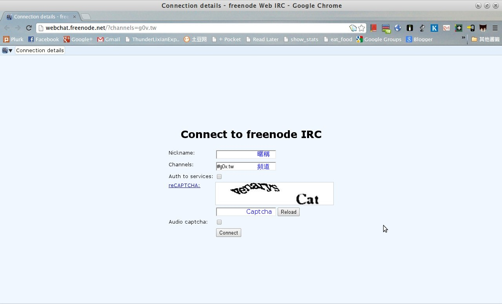
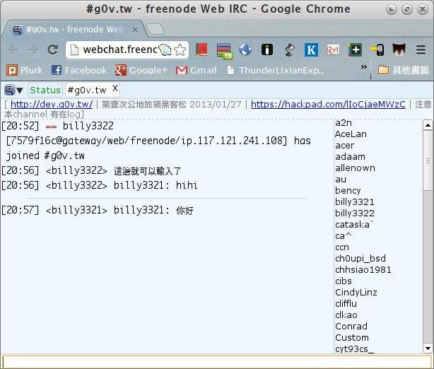
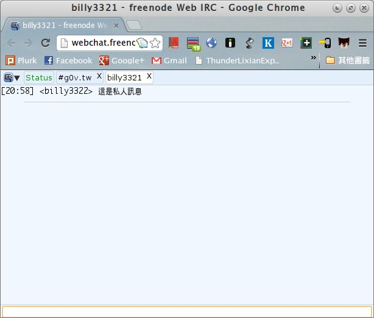

### 什麼是 IRC
IRC 是 Internet Relay Chat 的縮寫。IRC 是一種透過網路的即時聊天方式，類似M群或是聊天室這種群體聊天方式。網路上有許多的 IRC 伺服器，如 Freenode、Rizon 等。g0v.tw 選擇使用 Freenode （網址：irc.freenode.net）作為頻道所在的伺服器。我們在 Freenode 上開了一個頻道，頻道名稱是 **#g0v.tw**。

### 為什麼要用 IRC
有時候我們需要一個地方，即時且群體地討論一件事情，這時候就需要使用 IRC。有時候大家也會在上面進行即時討論，如果沒用 IRC ，就很難參與討論。

### 如何進入 IRC（web 版本）
Freenode 站有提供方便的 Web 介面，不用裝別的軟體就可以使用。您可以用瀏覽器登入 [#g0v.tw 聊天頻道](http://webchat.freenode.net/?channels=g0v.tw)

但這個頁面還是有一些欄位要填：

* Nickname

    就是你的 ID（又名暱稱）。每個登入的人都會有個英文稱呼，叫做 ID，是可以自己選的。人們說的話就會顯示成那個 ID 在說話。選一個想讓大家認識你的英文名吧。開頭要是英文的，後面可以接上數字或是底線，不可以有空白。像是 Abc123 是系統會接受，但很菜市場的名字。nicole_kidman、acbike、Ultrakid 之類會是還不難認的 ID。

* Channels

    是你要進入的聊天板，可以看見已經輸入了 #g0v.tw 字樣。

* Auth to Service

    如果你的帳號有認証過，那麼就請勾選「Auth to Service」，填寫相應的欄位

* Captcha

    接下來有塊歪七扭八的英文字是用來防程式登入的，叫做「Captcha」，請在下面的空行中照著填入。
    
都確認輸入無誤以後，點「Connect」按鈕就可以連上了。

### 進入 #g0v.tw 頻道之後要做什麼 (Web 版本)
* 顯示在右方欄的那些，是目前在這個聊天室裡的人們的 ID。有些人正在電腦前，但有些人雖然在連線狀態，但本人不一定在電腦前面，這稱為掛著。等到數分鐘，數小時，或數天之後，也許就會回神。
* 畫面的最下方，那條長框是輸入用的，在那邊打字，再按「Enter」就會送出，大家就看得到了。
* 左上方有「Status」與「#g0v.tw」兩個分頁。如果再加入別的頻道也會顯示出來，點它可以切換頻道。

#### 如何進入 #g0v.tw 頻道

如果在 Freenode 站，不小心退出了頻道，又想重新加入，請在下方的輸入條打下面的指令，然後按 Enter。最前面的斜線符號也不要漏打。

    /join #g0v.tw

#### 如何更換自己的 ID
使用指令 nick 更換自己的 id，舉例來說，你想要的新 ID 是 abc123，便輸入

    /nick abc123

#### 如何私下傳訊息給別人
把以下指令的 rosemary 換成你要傳的 ID，你們的交談會在左上角獨立成一個分頁。

    /msg rosemary

#### 如何表示動作

雖然在 IRC 上最近做的事說話，但有時會想要傳達自己的動作。例如說，我想表示我去睡了，可以打：

    /me 去睡了。
    
就會顯示成：

    * MindosCheng 去睡了。

#### 在 IRC 上打的文字出現亂碼怎麼辦
用 Web 版應該不會遇到這個問題。

#### 別人在 IRC 上面聊了什麼？

我們製作了一個簡單的 log 機器人，會把 IRC 上的訊息記錄下來。如果想知道今天大家聊了什麼，可以點[這邊](http://logbot.g0v.tw/channel/g0v.tw/today)觀看

