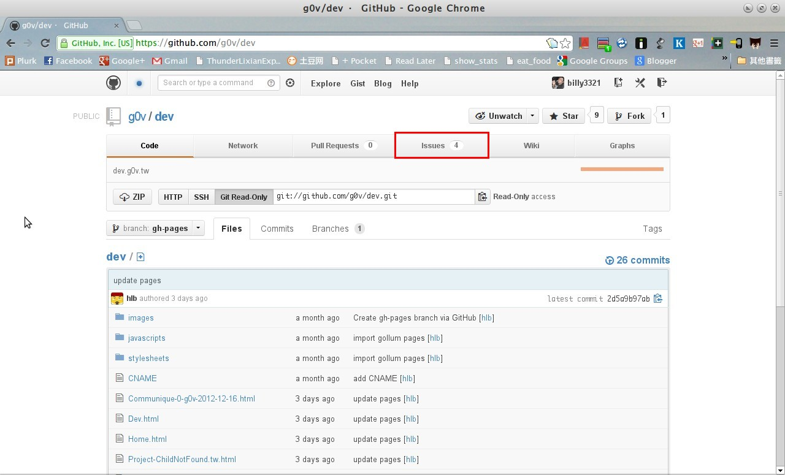
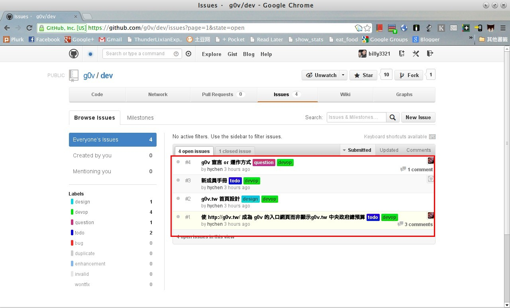
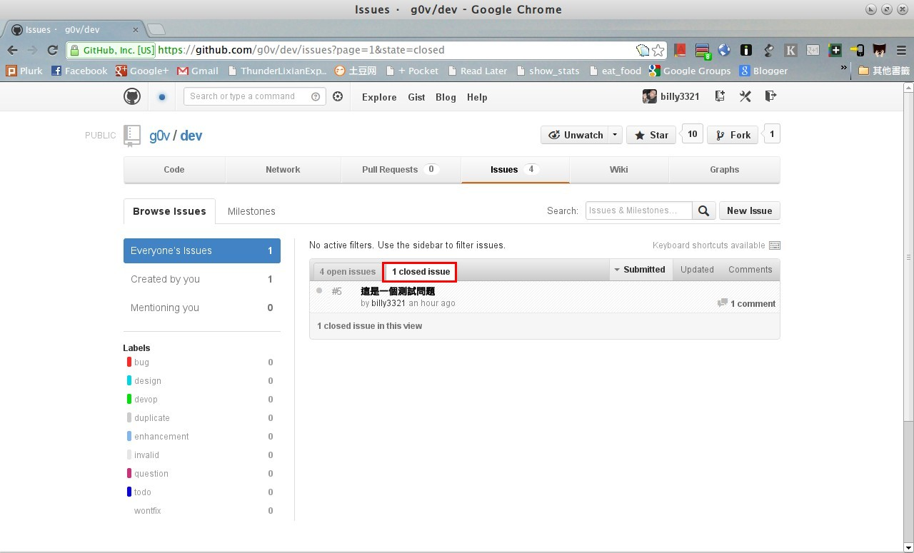
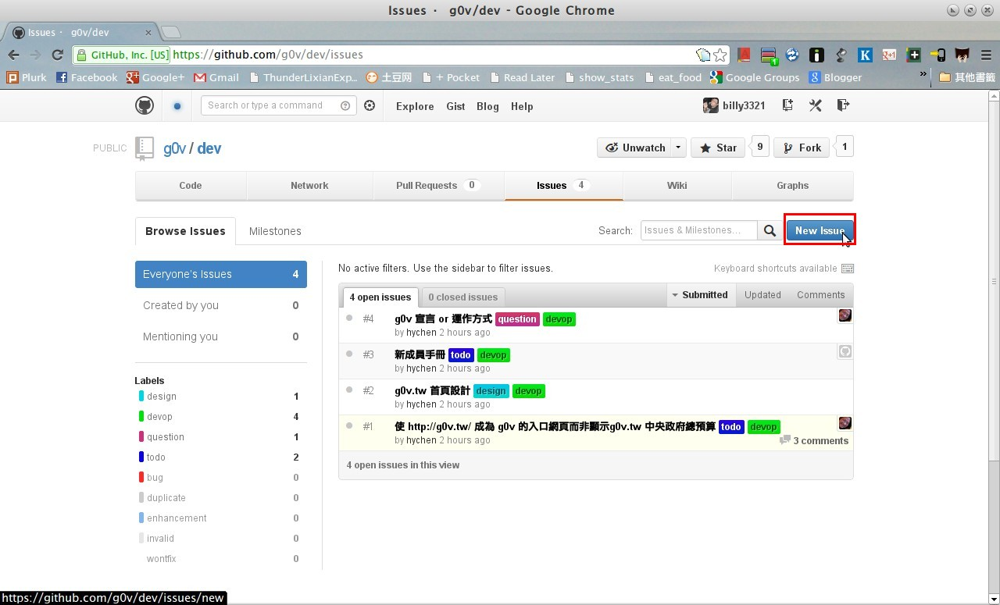
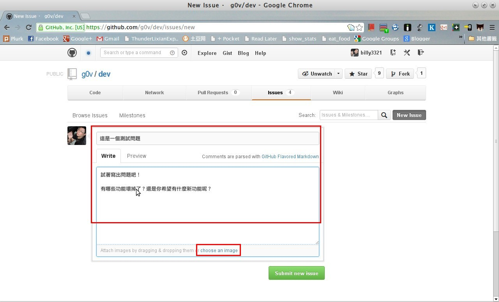
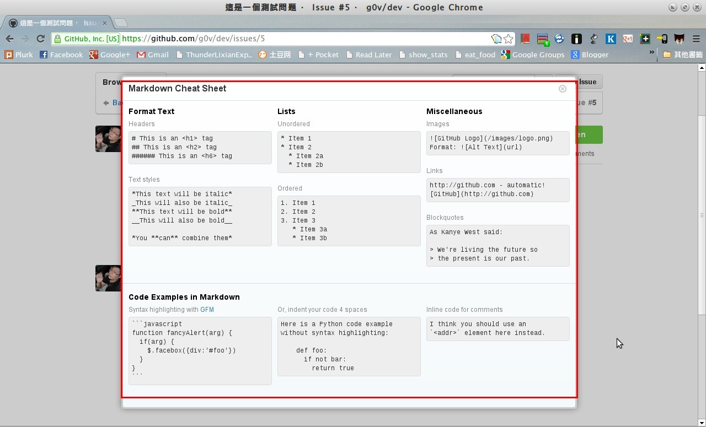
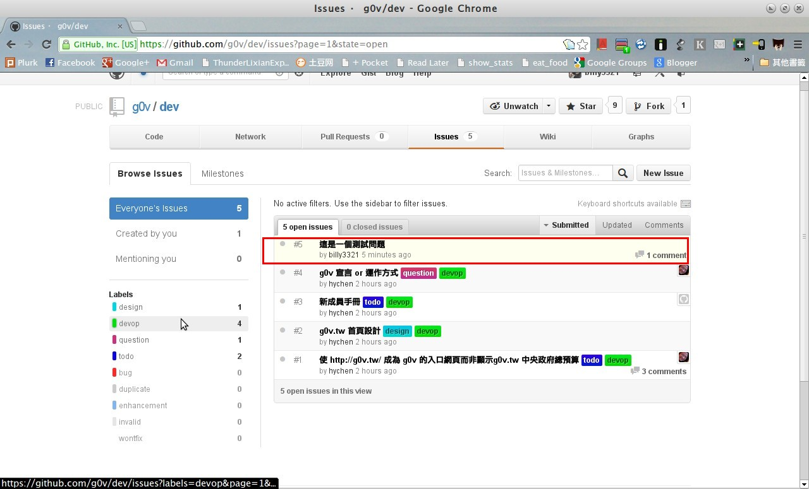
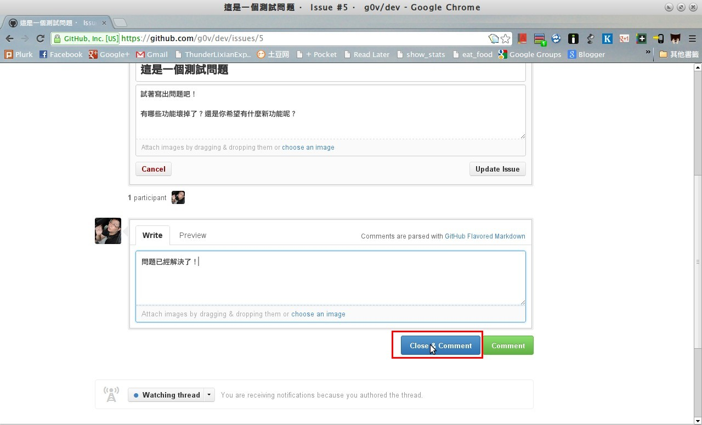
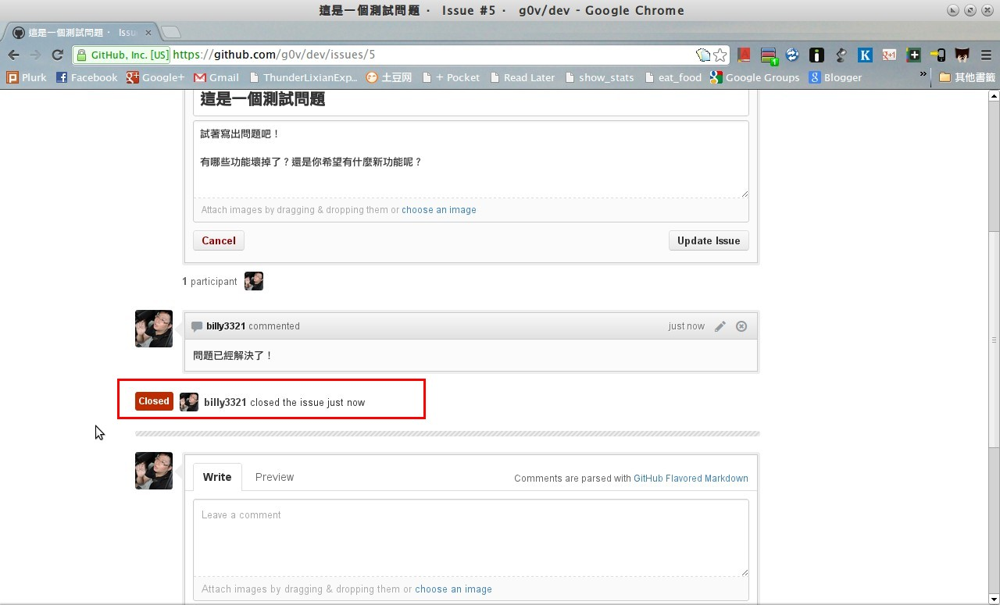

### Issue Tracker 是什麼？
如果我們希望專案有新功能，或是專案的某些功能出了問題，我們會稱這個東西是一個「issue（議題）」

Issue tracker 是針對專案相關的議題討論，也可以用來標記特定議題解決進度的系統。github 的專案通常也都附帶了一個簡單的 issue tracker。Issue tracker 系統其實就像是一個討論區，裏面都是給開發者下一步的動作，可以幫助開發者記住他們接下來要做的事情。

只要到 issue tracker 上面回報您希望開發者做的事情－－諸如修正網站問題，或是希望網站有新功能，都可以來這邊留下新的 Issue ，開發者們就會自動自發的去認領屬於他們的問題。只是在留下 issue 之前，要先確認一下是不是有人曾經留過類似的問題；重複的提問，總是會造成反感。想進一步了解，可以閱讀[無痛錯誤追蹤](http://chinesetrad.joelonsoftware.com/Articles/PainlessBugTracking.html)。

### 為什麼要用 Issue Tracker ?
因為人的腦袋是有限度的，網站開發者也是一樣，事情一多就會亂掉。如果沒有 issue tracker，開發者可能忙完手上的事情以後，就把其他問題給忘記了；而那些問題就這樣被扔在角落遺忘了。有了 issue tracker 以後，當開發者不知道要做什麼的時候，就可以到 issue tracker 上面去看看還有沒有他們該做而忘記做的事情。而對於那些提出問題或意見的人們，issue tracker 系統也可以讓他們方便的了解目前問題的解決進度，或是新功能的開發狀況。關於為什麼要用 issue tracker，可以參考[為什麼必須使用 Issue Tracking System 管理專案？](http://blog.xdite.net/posts/2012/03/26/issue-tracking-project-management-agile/)。

### 如何使用
#### 打開 issue tracker

首先要打開 issue tracker，先點選右上方的「Issues」按鈕。或點選此連結 - [Issues of g0v-dev](https://github.com/g0v/dev/issues)

#### 瀏覽 open/closed issue

進入以後，首先看到右下方一列就是目前所有正在討論中的 issue。如果有問題，可以先看看是不是已經被列在這裡，或是列在右邊的「closed issue」。如果有列出來，通常代表已經有人注意到這個問題了，可以點選加入討論。如果沒有看到，那就要自己建立一個。

#### 建立 New issue

建立一個issue請點選右上角「New issue」提交之前，您可能要先登入 github 帳號。

在左邊可以輸入問題，上面是標題，務必取一個讓人一目了然的標題。下面是內容，如果是網站有問題，請務必告訴我們：您使用哪種瀏覽器？您的使用環境為何？怎樣的步驟可以看到這個問題？這些描述有助於幫助我們找到問題點。如果有圖片更好，可以點選底下的「choose an image」上傳圖片。

這些內容可以以特定語法輸入。Github 的 issue tracker 支援[Markdown](http://markdown.tw/) 語法的文字。相關語法可以看[如何使用 Wiki](/howto/wiki.html)，或更詳細的[Markdown Cheatsheet](https://github.com/adam-p/markdown-here/wiki/Markdown-Cheatsheet)。底下是簡易的語法範例。

#### 預覽送出結果
輸入完畢以後，可以點選「Preview」預覽一下是不是輸入正確。是的話就可以送出了。

送出以後，可以在清單裏面看到

#### 修改現有 Issue
如果這個問題有後續發展，可以點選連結進去。可以點選右上角的「Edit」修改原本的問題，也可以在底下附加留言。

#### 關閉 Issue
如果問題解決了，就點選「Close」這個選項，把問題給關閉吧！

出現這個「Closed」的標記，就代表問題已經解決了。

以上就是使用方法！感謝您的閱讀。

