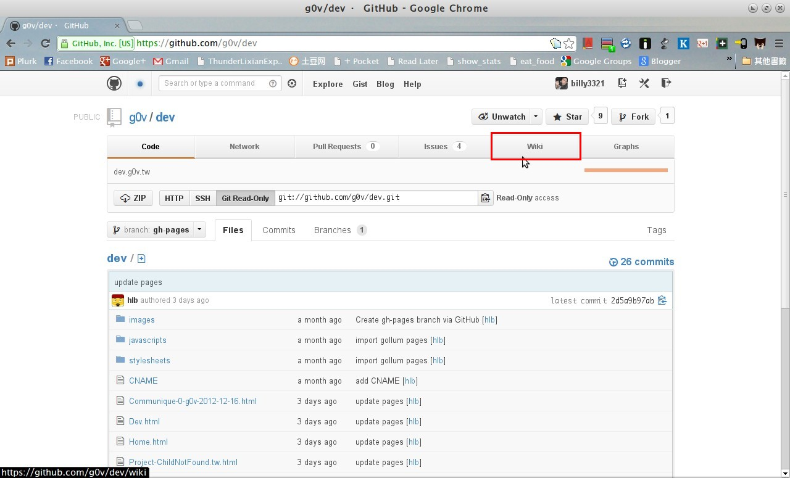
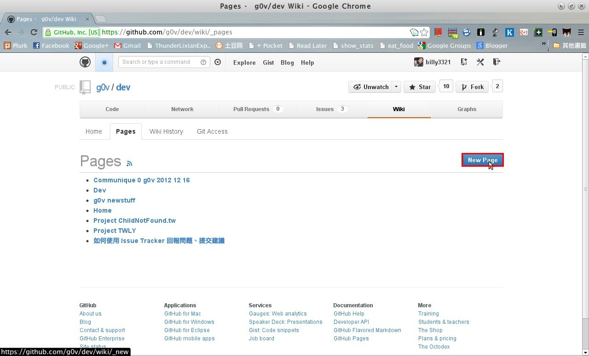
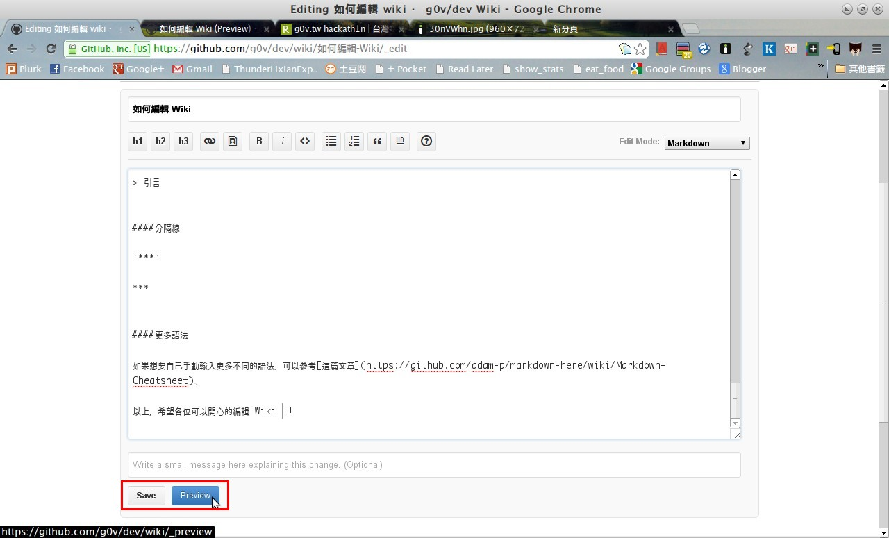
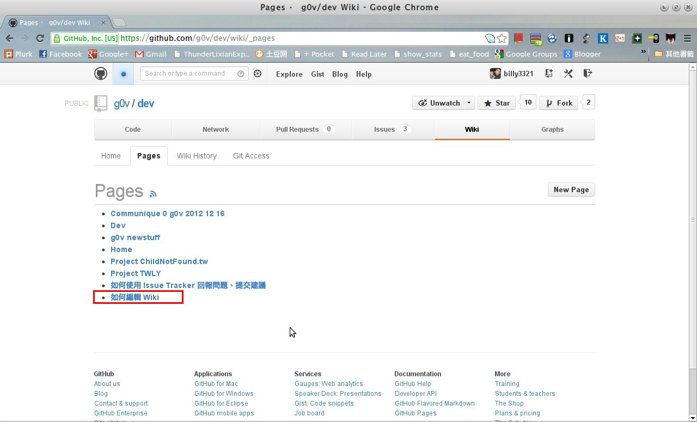
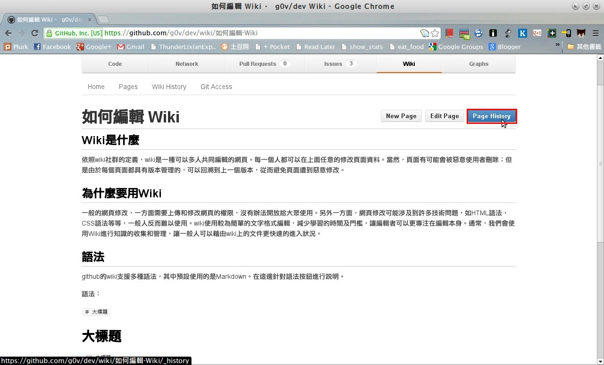
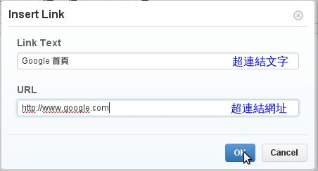
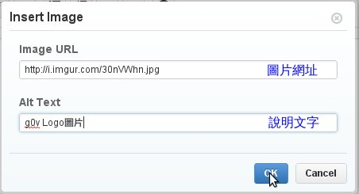
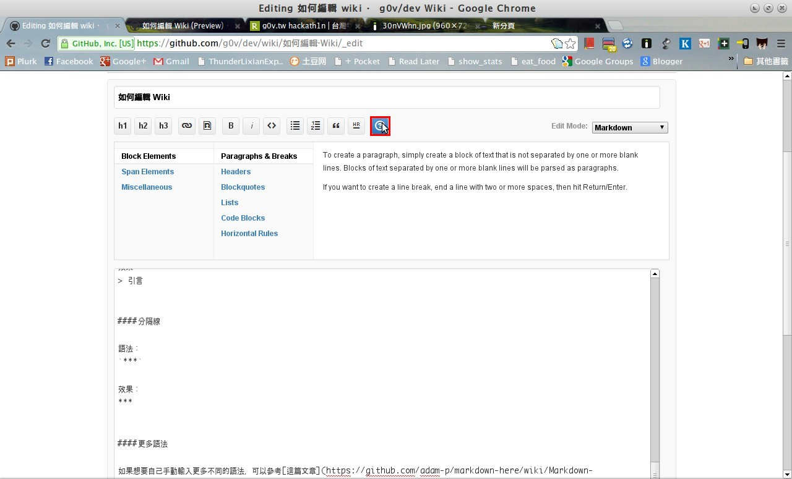

### Wiki 是什麼
依照 wiki 社群的定義，wiki 是一種可以多人共同編輯的網頁。每一個人都可以在上面任意的修改頁面資料。當然，頁面有可能會被惡意使用者刪除；但是由於每個頁面都具有版本管理的，可以回溯到上一個版本，從而避免頁面遭到惡意修改。

### 為什麼要用 Wiki
一般的網頁修改，一方面需要上傳和修改網頁的權限，沒有辦法開放給大眾使用。另外一方面，網頁修改可能涉及到許多技術問題，如 HTML 語法，CSS 語法等等，一般人反而難以使用。wiki 使用較為簡單的文字格式編輯，減少學習的時間及門檻，讓編輯者可以更專注在編輯本身。通常，我們會使用 wiki 進行知識的收集和管理，讓一般人可以藉由 wiki 上的文件更快速的進入狀況。

### 尋找 Wiki 頁面
要尋找頁面裡是否有相應的 wiki 頁面，可以在首頁中點選「[Wiki](https://github.com/g0v/dev/wiki)」

  
接著只會進入到 wiki 的首頁。要看到更多頁面，請點選旁邊的「[Pages](https://github.com/g0v/dev/wiki/_pages)」

### 新增、修改 Wiki 頁面
如果對於 wiki 的內容不滿意，或是覺得需要新增別的條目，可以新增 wiki 頁面，或是對已有的頁面進行修改。新增、修改 wiki 需要先以 github 帳號登入。如果想要修改相應的頁面，點進相應的頁面以後，在右上方點選「Edit Page」：

  
如果找不到相應的頁面，可以點選「New Pages」編輯新的頁面：

  
這邊可以輸入新的標題，點選「OK」送出。

  
編輯完畢以後，可以點選「Preview」先預覽頁面，也可以點選「Save」存檔退出。

  
編輯好的頁面就會出現在 Pages 列表上了。

  
可以點選「Page History」觀看修改的歷史紀錄：

### 語法
github 的 wiki 支援多種語法，其中預設使用的是[Markdown](http://markdown.tw/)。在這邊針對語法按鈕進行說明。

#### 語法及範例：
##### 大標題
語法：

    # 大標題

效果：
<h1>大標題</h1>

##### 中標題
語法：

    ## 中標題

效果：

<h2> 中標題</h2>

##### 小標題
語法：

    ### 小標題

效果：
<h3>小標題</h3>

##### 超連結
語法：

    [Google 首頁](http://www.google.com)

說明：

效果：

<a href="http://www.google.com">Google 首頁</a>

##### 圖片
語法：

    [g0v Logo圖片](http://i.imgur.com/3iwGfBW.png)

說明：
  

效果：
  

##### 粗體
語法：

    **粗體**

效果：<strong>粗體</strong>

##### 斜體
語法：

    _斜體_

效果：<em>斜體</em>

##### 程式碼
語法：

    <code>`程式碼`</code>

效果：<code>程式碼</code>

##### 項次
語法：

    * 第1項
    * 第2項

效果：
<ul>
<li> 第1項</li>
<li> 第2項</li>
</ul>

##### 編號項次
語法：

    1. 第1項
    1. 第2項

效果：
1. 第1項
2. 第2項

##### 引言
語法：

    ; 引言

效果：

<blockquote>
引言
</blockquote>

##### 分隔線
語法：

    ***

效果：

##### 更多語法
如果想要自己手動輸入更多不同的語法，可以點擊問號按鈕參考：

  
除了點擊問號按鈕以外，也可以參考[Markdown Cheatsheet](https://github.com/adam-p/markdown-here/wiki/Markdown-Cheatsheet)
  
以上，希望各位可以開心的編輯 Wiki !!

